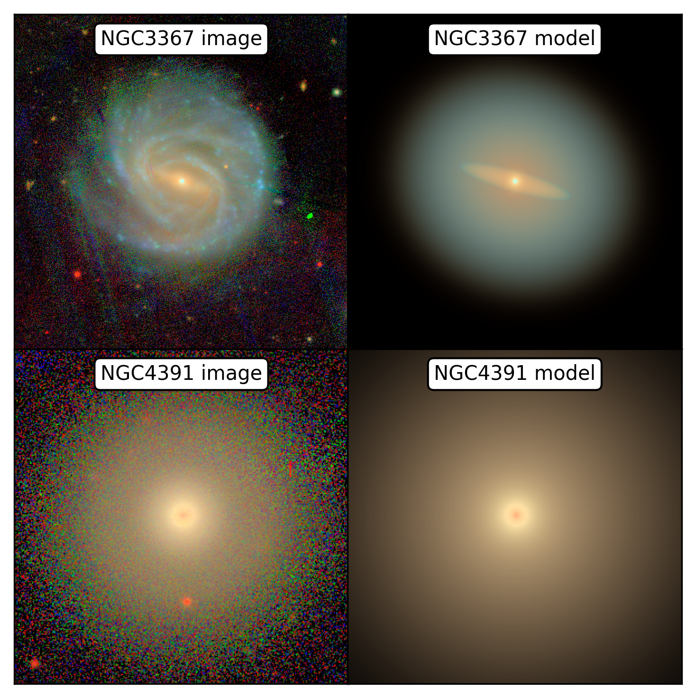
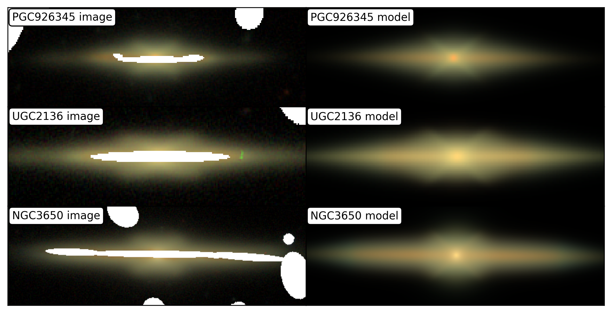
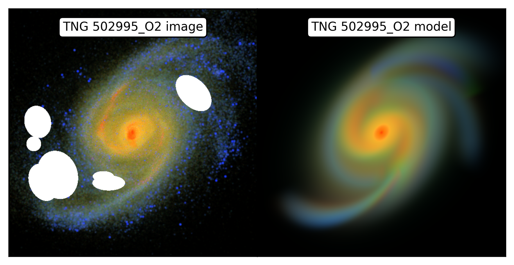

# IMFIT-MW

## General information

IMFIT-MW is a Python-based extension of [IMFIT](http://www.mpe.mpg.de/~erwin/code/imfit/) ([Erwin, 2015](https://ui.adsabs.harvard.edu/abs/2015ApJ...799..226E/abstract)) for simultaneous fitting of multiwavelength images and controlling the wavelength dependence of photometric parameters.

The project is largely inspired by [GALFITM](https://www.nottingham.ac.uk/astronomy/megamorph/) ([Vika et al., 2013](https://ui.adsabs.harvard.edu/abs/2013MNRAS.435..623V)) and provides similar functionality. IMFIT-MW uses [PyImfit](https://pypi.org/project/pyimfit/) to construct IMFIT models and [lmfit](https://lmfit.github.io/lmfit-py/) for optimization.

IMFIT-MW may therefore be particularly useful for users already familiar with IMFIT.

## Showcase examples

*NGC 3367 and NGC 4391 with their multiwavelength models. RGB image was constructed using z, r, g bands.*

*Examples of edge-on galaxies with X-structures at the centre, along with fitted multiwavelength models including B/PS bulge model. RGB image was constructed using z, r, g bands.*

*A spiral galaxy from TNG50-SKIRT Atlas and its multiwavelength model with spiral arms. RGB image was constructed using Ks, i, u bands.*

## Installation

### Requirements

IMFIT-MW requires:

- Python 3
- PyImfit
- NumPy
- Astropy
- lmfit

The [standard PyImfit](https://pypi.org/project/pyimfit/) package is sufficient for running IMFIT-MW. However, it is strongly recommended to use the modified version available at [https://github.com/IVChugunov/pyimfit](https://github.com/IVChugunov/pyimfit). My modifications improve its performance by a factor of a few ([see Performance and parallelization](#performance-and-parallelization)), making it comparable with original IMFIT; these modifications may probably be added to the standard package in the future.

IMFIT-MW also supports custom IMFIT functions. If custom C++ IMFIT functions are required, PyImfit must be built from source with the corresponding IMFIT functions available in embedded IMFIT. My modification of PyImfit already features models of spiral arms, B/PS bulges and edge-on broken disc model.

### Installation

Simply clone the repository:

    git clone https://github.com/IVChugunov/IMFIT-MW.git
    cd IMFIT-MW

No separate installation of IMFIT-MW is required. The program is run directly as a Python script.

## Usage

A multiwavelength fit requires, for each band:

- an image;
- a noise/error map;
- an IMFIT configuration file containing the initial model parameters.

A PSF and a mask are optional.

In addition, two configuration files are required:

- a **Python configuration file**, specifying the data files, wavelengths, output files and optimizer settings;
- a **coupling file**, using an IMFIT-like format to specify how individual parameters depend on wavelength.

The general command is:

    python3 imfit-mw.py config.py

File paths in the configuration are interpreted relative to the current working directory. The configuration file can use an explicitly defined base directory if paths relative to the configuration file are desired.

### Python configuration file

The configuration file is an ordinary Python module. The following variables are used.

#### Bands and wavelengths

    bands = ["g", "r", "i", "z"]
    wavelengths = [481, 617, 752, 866]

`bands` specifies the names of the bands. `wavelengths` contains their corresponding wavelengths. The units are not important, but must be consistent between bands. Any monotonic coordinate can in principle be used; for example, logarithmic wavelength can be used if this is appropriate for the desired parametrization.

#### Input files

    imfit_paths = [f"NGC4391/{band}/input.imfit" for band in bands]
    image_paths = [f"NGC4391/{band}/image.fits" for band in bands]
    noise_paths = [f"NGC4391/{band}/sigma.fits" for band in bands]

`imfit_paths` specifies the standard IMFIT configuration file containing the initial parameters for each band.

`image_paths` specifies the science images.

`noise_paths` specifies the noise/error maps. Their interpretation is controlled by `noise_types`:

    noise_types = "sigma"

The allowed values are:

- `"sigma"` — the supplied image contains 1-sigma uncertainties;
- `"variance"` — the supplied image contains variances;
- `"weight"` — the supplied image contains inverse variances.

A single string can be supplied when the same file is used for all bands. Alternatively, a list with one entry per band can be supplied.

For example:

    noise_types = "sigma"

is equivalent to

    noise_types = ["sigma", "sigma", "sigma", "sigma"]

for four bands.

The same single-value/list convention is used for PSFs and masks:

    psf_paths = [f"NGC4391/{band}/psf.fits" for band in bands]
    mask_paths = None

A single path is used for every band, while a list specifies a separate file for each band. `None` means that no PSF or mask is used.

#### Output files

The paths for fitted IMFIT configurations, model images and residual images are specified separately:

    fit_paths = [f"NGC4391/{band}/fit.imfit" for band in bands]
    model_image_paths = [f"NGC4391/{band}/model.fits" for band in bands]
    residual_paths = [f"NGC4391/{band}/residual.fits" for band in bands]

Any of these can be set to `None` if the corresponding output should not be written.

#### Coupling configuration

The coupling file is specified with:

    coupling_path = "coupling_NGC4391.imfit"

Its syntax is described below.

#### Optimizer settings

Options passed to `lmfit.Minimizer.minimize()` can be specified as a dictionary:

    minimizer_kwargs = {
        "method": "least_squares",
        "xtol": 1e-6,
        "ftol": 1e-6,
        "gtol": 1e-6,
        "max_nfev": 50000,
        "verbose": 2
    }

The available options depend on the selected `lmfit` optimization method.

### Coupling file

The coupling file deliberately resembles a standard IMFIT configuration file. Instead of specifying numerical parameter values, the entries specify how the corresponding parameter is parametrized across wavelength.

For example:

    X0       0
    Y0       0
    FUNCTION Sersic
    PA       0
    ell      0
    n        1
    I_e      3
    r_e      1
    FUNCTION Exponential
    PA       0
    ell      0
    I_0      3
    h        1

The `X0` and `Y0` parameters precede `FUNCTION`, as in ordinary IMFIT files. If another function set does not have its own `X0` and `Y0`, the coordinates of the preceding function set are used.

### Wavelength dependence

By default, IMFIT-MW uses a polynomial to describe wavelength dependence.

A numerical specification denotes the polynomial degree:

- `0` — parameter is constant across all bands;
- `1` — linear wavelength dependence;
- `2` — quadratic dependence;
- ...
- `N-1` — all `N` bands are independent.

For example:

    n       1
    I_e     3

for four bands means that `n` is described by a linear dependence, while `I_e` is independently fitted in every band.

The optimizer does **not** directly fit polynomial coefficients. Instead, it fits the values of the parameter at selected control bands. The polynomial is then constructed from those values and evaluated at all observed wavelengths.

Control bands can also be specified explicitly instead of specifying the polynomial degree. For example:

    n       g,z
    r_e     r

Here `n` is controlled by its values in the `g` and `z` bands, giving a linear dependence, while `r_e` is constant and controlled by its value in the `r` band.

When a numerical degree is supplied, control bands are selected automatically, approximately uniformly distributed over the available wavelength range. Thus, for `N` bands:

- degree `0`: first band;
- degree `1`: first and last bands;
- degree `2`: first, middle and last bands;
- ...
- degree `N-1`: all bands.

### Shared parameters

Parameters can be explicitly tied together using the `shared:` specification.

For example:

    X0       0
    Y0       0

    FUNCTION Sersic
    PA       0
    ...

    FUNCTION Exponential
    PA       shared:Sersic__0__PA
    ...

The exact parameter name is formed from the IMFIT function name, function index (simply the number of function in order of declaration, beginning from zero) and parameter name. This notation is useful when parameters belonging to different components should have exactly the same value.

### Custom wavelength-dependence functions

Additional wavelength-dependence functions can be defined directly in the Python configuration file.

For example, below is an example a step function defining a few wavelength ranges, each with constant value. Each control wavelength defines the beginning of a new interval:

    import numpy as np
    def step(wavelengths, control_wavelengths, control_values):
        indices = np.searchsorted(control_wavelengths, wavelengths, side="right") - 1
        indices = np.clip(indices, 0, len(control_values) - 1)
        return np.asarray(control_values)[indices]

The function is then made available to the coupling file through:

    wavelength_functions = {
        "step": step
    }

The corresponding coupling entry can be:

    n       g,i function:step

A wavelength-dependence function must accept three arguments:

    function(wavelengths, control_wavelengths, control_values)

and return the parameter value at every wavelength.

The built-in polynomial parametrization is always available and does not need to be specified in `wavelength_functions`.

This makes it possible to implement wavelength dependences that are not well described by a polynomial, without modifying the main IMFIT-MW code.

## Examples of use

The repository contains several complete examples of use.
 
### NGC 4391

The `NGC4391/` directory contains a four-band example with `g`, `r`, `i` and `z` images. Each band contains an image, noise map, PSF and an IMFIT initial configuration file.

The corresponding Python configuration is:

    config_NGC4391.py

and the wavelength-dependence configuration is:

    coupling_NGC4391.imfit

The fit can be started with:

    python3 imfit-mw.py config_NGC4391.py

The repository also contains:

    config_NGC4391_experimental.py
    coupling_NGC4391_experimental.imfit

which demonstrates explicit control bands, shared parameters and a custom step-like wavelength dependence.

### NGC 3367

This example is qualitatively similar to NGC 4391, but it is more workload-intendive due to the larger image, more complex model and 5 bands instead of 4 (`g`, `r`, `i`, `z`, `y`). The fit can be run with:

    python3 imfit-mw.py config_NGC3367.py

This example is RAM-intensive (roughly 6 GB) and may fail if out of memory; consider changing `minimizer_kwargs['method']` to decrease RAM usage.

### Additional examples

The `BPS/` directory contains additional examples involving custom IMFIT functions, such as:

    python3 imfit-mw.py BPS/1804_16_0/config.py

This can be run only in the case if modified PyImfit is installed, which includes functions `SersicBPS` and `EdgeOnBrokenDisk`.

## Input data

IMFIT-MW does not impose a particular directory structure on the data. The location of every file is specified by the Python configuration file.

The only requirement is that the corresponding lists contain one entry per band where band-dependent files are used.

The initial model files are ordinary IMFIT configuration files and are parsed by PyImfit. Therefore, model functions available to PyImfit can be used by IMFIT-MW.

## Performance and parallelization

The multiwavelength residual is evaluated independently for each band. IMFIT-MW can therefore evaluate different bands in parallel.

The recommended PyImfit version ([see Requirements](#requirements)) contains modifications making this possible. Also, modified PyImfit is not bound to an old FFTW version which slowed down convolution considerably, unlike standard PyImfit.

The exact performance depends on the number and complexity of model components, image size, number of bands, PSF convolution and the optimization method. In general, single-thread performance is comparable with GALFITM. Parallelization impact depends on number of bands: for instance, with 5 bands parallelization the overall time may be decreased by a factor of 3.

## Limitations

IMFIT-MW is intended primarily for photometric multiwavelength fitting with models supported by IMFIT/PyImfit.

It is not intended to reproduce all functionality of GALFITM or to provide a general framework for arbitrary wavelength-dependent models. In particular, the user is expected to define the desired parametrization through the coupling configuration and, where necessary, custom Python wavelength-dependence functions.

As with any nonlinear multi-parameter fitting procedure, the result can depend on the initial parameters, parameter bounds, model choice and optimization method.

## Credits

IMFIT-MW is based on [IMFIT](http://www.mpe.mpg.de/~erwin/code/imfit/) by Peter Erwin ([Erwin, 2015](https://ui.adsabs.harvard.edu/abs/2015ApJ...799..226E/)).

The multiwavelength parametrization is largely inspired by [GALFITM](https://www.nottingham.ac.uk/astronomy/megamorph/) and its description by [Vika et al. (2013)](https://ui.adsabs.harvard.edu/abs/2013MNRAS.435..623V).

The work describing IMFIT-MW is forthcoming (Chugunov, submitted). If you use IMFIT-MW in your research, please cite the corresponding publication when available. Any comments and suggestions are welcome.
